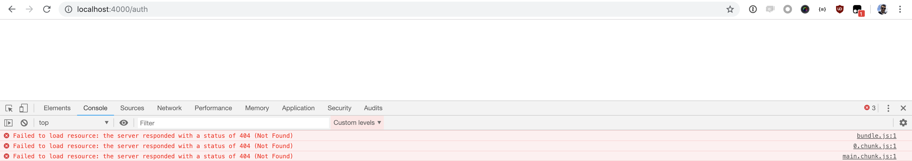
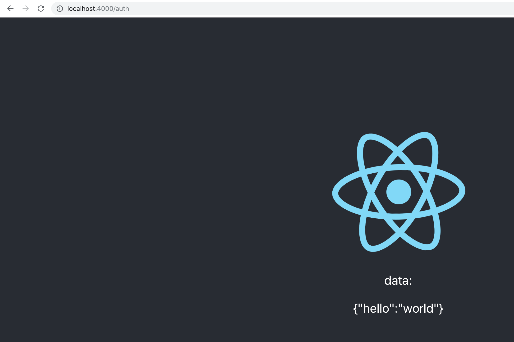

This repository is a demo of possible development setup, where one wants to develop CRA under the gateway.

In the current setup SPA should be served under:
`/auth`, while the API is served under `/auth/api*`.

## This does not work:
```bash
# terminal 1
cd cra-app
npm start
# terminal 2
cd api-app
npm start
# terminal 3
cd gateway
npm start

# open localhost:4000/auth
```




## This does work
```bash
# terminal 1
cd cra-app
npm run build
cd ./build
npx serve . -p 4100
# terminal 2
cd api-app
npm start
# terminal 3
cd gateway
npm start

# open localhost:4000/auth
```

